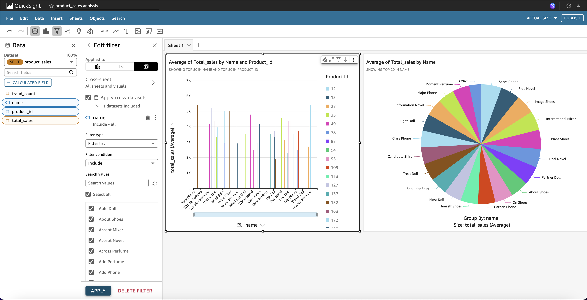

# 🛒 End-to-End Real-Time E-commerce Fraud Detection Pipeline using Airflow, PostgreSQL, AWS, and Quicksight

This project demonstrates a real-time, end-to-end fraud detection data pipeline using Apache Airflow, PostgreSQL, AWS Lambda, Amazon S3, Redshift, and Quicksight.

---

## 📌 Project Architecture


---

## 📂 Tools & Technologies Used

- **ETL & Workflow Orchestration:** Apache Airflow (Dockerized)
- **Database:** PostgreSQL
- **Cloud Services:** AWS Lambda, S3, Redshift, IAM, SNS
- **Analytics & Visualization:** Amazon Quicksight
- **Infrastructure:** Docker, Docker Compose
- **Monitoring:** CloudWatch
- **Source Control:** GitHub

---

## 🚀 Project Workflow Overview

```markdown
1. Synthetic e-commerce data generated and ingested into PostgreSQL via Airflow DAG.
2. Aggregation DAG computes product-level total sales and fraud counts.
3. AWS Lambda is invoked via DAG to detect fraudulent transactions.
4. Results updated back to PostgreSQL.
5. Fraud alerts are sent through Amazon SNS to email.
6. Aggregated dataset is exported to Amazon S3.
7. S3 bucket data is imported to Amazon Redshift.
8. Redshift is connected to Amazon Quicksight for visualization.
```

---

## 🐘 PostgreSQL Database Setup

```bash
# .gitignore
.env
__pycache__/
*.pyc
postgres_data/
*.db
*.log
airflow_logs/

# Initialize PostgreSQL
docker-compose up -d
# Ensure volumes: are mapped correctly in docker-compose.yaml
```

---

## 🧱 DAGs Implemented

### 1. `csv_to_postgres_dag.py`
Loads synthetic CSVs into PostgreSQL tables.

### 2. `data_quality_check_dag.py`
Performs checks on loaded data (e.g., row counts > 0).

### 3. `aggregation_dag.py`
Creates `product_sales` table by aggregating transactions.

### 4. `process_new_transactions_dag.py`
Invokes AWS Lambda for fraud detection and updates DB with fraud flags.

### 5. `fraud_alerts_notification_dag.py`
Sends fraud alerts via Amazon SNS to subscribed emails.

### 6. `export_to_s3_dag.py`
Exports `product_sales.csv` and uploads it to Amazon S3.

---

## 🔐 AWS Integration

### ✅ Lambda
- Created `process_transactions_lambda`
- Handles fraud logic based on rules (high amount, odd hour, crypto)
- Updates PostgreSQL transaction record via DAG

### ✅ SNS
- Created `FraudAlertsTopic`
- Subscribed verified email
- DAG sends alerts using `boto3`

### ✅ S3
- Bucket: `ecommerce-dataset-bucket`
- Used to export `product_sales.csv` from Airflow to cloud

### ✅ Redshift
- Loaded data from S3 to `product_sales` table in Redshift
- Used SQL editor to query

---

## 📊 Visualizations in Amazon Quicksight

Connected Redshift to Quicksight to create dashboards:
- Total sales per product
- Fraud count per category
- Monthly transaction trends



---

## 📸 Sample Screenshots

### Airflow DAGs


### CloudWatch Lambda Logs


### S3 Bucket Upload


### Redshift Query Editor


---

## 🧠 Key Learnings

- Setting up real-time fraud detection using Airflow and AWS Lambda
- Working with PostgreSQL and Amazon Redshift
- Building a fully-automated data pipeline with alerts
- Visualization using Quicksight and triggering alerts via SNS

---

## 📎 Author

**Jerry Vishal Joseph Arockiasamy**  
[LinkedIn](https://linkedin.com/in/jerryvishal) | [GitHub](https://github.com/JerryVishal)

---

> ✅ Feel free to ⭐ this repo and fork it if you found it helpful!
